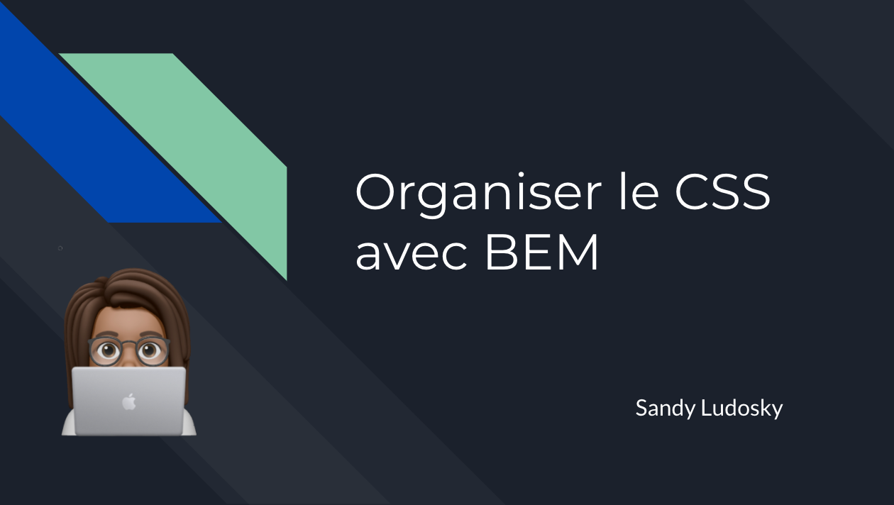

# Organiser le CSS avec la méthodologie BEM

*Ce webinar est une introduction à la méthodologie BEM, avec une terminologie reconnaissable, pour créer des composants réutilisables et flexibles et créer du CSS plus structurée* 

## Au programme :
- créer une base de code solide et flexible 
- créer des règles CSS avec une convention de nommage standardisée et une syntaxe stricte
- créer une architecture CSS structuré, ordonné et organisé

## les outils & ce dont vous aurez besoin : 
- un code éditeur [Visual Code Studio](https://code.visualstudio.com/) 
- une dernière version stable de [Node](https://nodejs.org/en/)
- un navigateur moderne: Chrome, Firefox ou Safari

## Pour démarrer :

`git clone [url répertoire]`

`npm install`

`npm start`